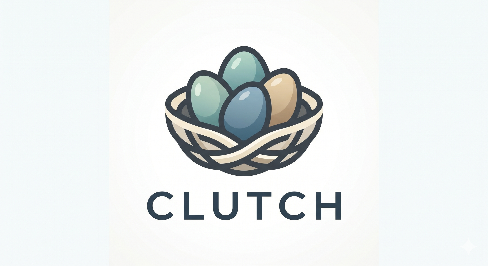

# CLUTCH

<p align="center">
  
</p>

CLUTCH is a local-first Codex orchestration layer for AI and robotics teams
that work across multiple PCs, shared datasets, local artifacts, and long-lived
project contexts.

Landing page preview:
[https://trex-clutch.github.io/clutch-landing-preview/](https://trex-clutch.github.io/clutch-landing-preview/)

It is built for the common lab setup where one workstation owns the main
development session, another machine has extra compute or hardware access, and
the operator needs a visible way to keep Codex sessions, project state, backups,
and collaboration evidence aligned.

## Why CLUTCH Exists

Plain Codex sessions are powerful, but research and robotics work often needs
more structure:

- a session should re-enter the right project with the right role;
- one PC may be the main operator machine while another works as a worker;
- collaboration requests and worker results should be visible, not hidden in
  chat history;
- large datasets, model weights, media, and robot logs should not be forced
  into git;
- reproducibility should include source heads, metadata, snapshots, artifact
  pointers, and restore evidence;
- long unattended work should have an explicit plan, scope, stop condition, and
  verification trail.

CLUTCH provides that layer without shipping your credentials, machine names, IP
addresses, or private project data.

For a visual overview with example prompts and a GitHub call-to-action, open
the online preview or static source:
[Online CLUTCH landing preview](https://trex-clutch.github.io/clutch-landing-preview/)
and [CLUTCH public landing page](site/index.html). For copy-ready operating
examples, use the [Prompt Cookbook](docs/prompt-cookbook.md).

## 10-Minute First Use Path

After install, a new user should be able to prove the core loop without any
private infrastructure:

1. Run the first-run wizard and choose local folders.
2. Run `session-entry` and confirm the Web console opens or prints a URL.
3. Register a small git project with `project-create`.
4. Attach the active Codex session as `main`.
5. Create a local backup and a snapshot.
6. Run `project-refresh --dry-run` to see what is ready and what still needs
   optional GitHub or artifact setup.

That path verifies the CLUTCH foundation: session re-entry, Web visibility,
project registration, backup/snapshot evidence, and safe preview-first status
checks.

## Core Features

- **Project re-entry**: bind a Codex session to a project as `main`, `worker`,
  or `observer`, then reopen the right project docs and local memory.
- **Multi-PC collab**: coordinate a main and worker machine through a shared
  transport, Codex instructions, and monitor evidence.
- **Collab monitor**: keep an operator-visible view of roles, peer freshness,
  active requests, and recent results.
- **Web console**: inspect project warnings, readiness checks, collab status,
  command previews, snapshots, backups, and Help from a browser.
- **Operator notifications**: keep long-running work and needs-input states
  visible without treating notification state as approval.
- **Backup and reproducibility**: track code source, snapshot metadata,
  machine-local backups, restore smoke results, and large artifact pointers.
- **Away-development plans**: define what Codex may do while the operator is
  away, where it must stop, and how it must verify progress.
- **Public first-run wizard**: install with your own GitHub account, local
  directories, artifact store, machine id, and optional multi-PC setup.

## Lab Patterns

- **Single-PC project control**: use CLUTCH as a durable Codex re-entry layer
  with Web status, backups, snapshots, and Help.
- **Two-PC collaboration**: keep one machine as `main`, another as `worker`,
  and use collab transport plus the Web Monitor tab for visible handoffs.
- **Large-model or robotics work**: keep source and compact docs in git while
  recording datasets, weights, media, robot logs, and caches as artifact
  pointers.
- **Away development**: give Codex a bounded objective, allowed scope, expiry,
  stop conditions, and verification requirements before leaving it unattended.

## Quick Start

Download a CLUTCH release zip, then:

```bash
unzip clutch-public-*.zip
cd clutch-public-*
export CLUTCH_HOME="${CLUTCH_HOME:-$HOME/.clutch}"
bash installer/install.sh --prefix "$CLUTCH_HOME"
cd "$CLUTCH_HOME/foundation/current"
python3 installer/clutch_first_run_wizard.py
python3 installer/clutch_doctor.py
python3 scripts/clutch_ctl.py session-entry
```

The installer does not use sudo. The interactive first-run wizard writes the
local setup after asking for confirmation-style inputs. Use `--plan-only` if
you want to preview the files before writing them. The first-run wizard asks for local paths,
machine identity, an admin token, GitHub setup preference, and optional collab
pairing. It does not contain any preset private accounts or peer addresses.
After first-run setup, `session-entry` starts the local Web console. In a safe
local desktop session it also asks the OS to open the browser; on headless or
SSH sessions it prints the local URL instead.

For routine Codex use, add the generic CLUTCH entry template to your
`AGENTS.md` so new Codex sessions run `session-entry` first:
[Codex Session Entry](docs/codex-session-entry.md).

To verify an extracted public release before using it:

```bash
make verify
```

For feature-by-feature validation, use the
[Verification Matrix](docs/verification-matrix.md).

To run the read-only final visibility review without changing any GitHub
setting:

```bash
make visibility-review
python3 tools/clutch_public_visibility_review.py --root . --json
```

To check only the static landing page over local HTTP:

```bash
make landing-smoke
```

To verify the first-run Web console auto-start and Help/Monitor UI:

```bash
make web-smoke
python3 tools/clutch_public_web_smoke.py --root . --json
```

To prove the packaged file-based collab transport locally:

```bash
make collab-smoke
python3 tools/clutch_public_collab_smoke.py --root . --json
```

## First Project

After first-run setup, create a normal git workspace and register it with
CLUTCH. This keeps your project files in your workspace while CLUTCH's local
memory, snapshots, and recovery metadata stay under `CLUTCH_HOME`.

```bash
MACHINE_ID="$(python3 scripts/clutch_ctl.py machine-profile --json \
  | python3 -c 'import json,sys; print(json.load(sys.stdin)["machine_id"])')"
PROJECT_ROOT="$HOME/clutch-projects/my-project"

mkdir -p "$PROJECT_ROOT"
cd "$PROJECT_ROOT"
git init
git config user.name "CLUTCH Example"
git config user.email "example@clutch.local"
printf '# My Project\n' > README.md
git add README.md
git commit -m "Initial project"
git branch -M main

cd "$CLUTCH_HOME/foundation/current"
python3 scripts/clutch_ctl.py project-create \
  --project my-project \
  --display-name "My Project" \
  --machine-workspace "$MACHINE_ID=$PROJECT_ROOT" \
  --repo-source "my-project:$MACHINE_ID=$PROJECT_ROOT" \
  --no-repo-required \
  --participant-machine "$MACHINE_ID" \
  --owner-machine "$MACHINE_ID" \
  --role-policy none \
  --no-admin-guard-required \
  --yes

python3 scripts/clutch_ctl.py session-attach --project my-project --bind-role main --cwd "$PROJECT_ROOT" --yes
python3 scripts/clutch_ctl.py project-backup --project my-project
python3 scripts/clutch_ctl.py project-snapshot --project my-project --write
```

Use `project-refresh --dry-run` before applying sync or metadata changes:

```bash
python3 scripts/clutch_ctl.py project-refresh --project my-project --dry-run
```

## Multi-PC Collaboration

CLUTCH is strongest when two or more machines cooperate on one project. The
recommended public setup is:

1. Install CLUTCH on each PC.
2. Use a direct wired LAN or another reliable local network.
3. Create one shared collab folder owned by you.
4. Use the same project id on all PCs.
5. Attach the operator machine as `main`.
6. Attach the second machine as `worker`.
7. Keep the Web Monitor tab or collab monitor visible during work.

The public distribution includes a safe file-based collab helper:

```bash
python3 collab_transport/scripts/clutch_collab_file_transport.py init \
  --shared-root /tmp/clutch-collab \
  --project-id demo \
  --machine-id main-laptop \
  --role main
```

See [Multi-PC Collab](docs/multi-pc-collab.md) for the full guide.
For a step-by-step lab walkthrough, see
[Two-PC Lab Tutorial](docs/two-pc-lab-tutorial.md).

## Backup Model

CLUTCH does not assume every file belongs in git.

- Source code, compact docs, configs, and small results belong in the project
  repository when appropriate.
- Local backup bundles preserve recoverable working state.
- Snapshot metadata records source heads, machine ids, restore evidence, and
  artifact pointers.
- Large datasets, model weights, robot bags, media dumps, and caches stay in a
  user-owned artifact store unless the project explicitly chooses otherwise.

See [Backup And Restore](docs/backup-and-restore.md).

## Away Development

Away development is not unrestricted automation. A CLUTCH away plan records:

- operator objective;
- allowed files and actions;
- stop conditions;
- verification requirements;
- expiry time;
- checkpoint expectations.

When the request falls outside that plan, Codex should stop and ask.

See [Away Development](docs/away-development.md).

## Release Confidence

The public package is built around a private-first release process. Before a
staged tree is treated as publishable, CLUTCH expects:

- the public release gate to report `ready_for_operator_review`;
- scanner checks to report `finding_count=0`;
- GitHub Actions to run the same scanner, release gate, visibility review,
  landing smoke, Web smoke, collab smoke, and install smoke on public pushes
  and pull requests;
- issue templates and the PR template to keep reports sanitized and
  operator-approval boundaries visible;
- `make verify` to provide a familiar public repo verification entrypoint;
- `tools/clutch_public_verify.py --root . --json` to run the scanner, release
  gate, visibility review, landing smoke, Web smoke, collab smoke, and install
  smoke from one command;
- `make visibility-review` and
  `tools/clutch_public_visibility_review.py --root . --json` to produce a
  read-only final visibility review with
  `remote_visibility_change_performed=false`;
- `tools/clutch_public_landing_smoke.py --root . --json` to prove the static
  landing page, CSS, brand image, and GitHub call-to-action load over HTTP;
- `tools/clutch_public_web_smoke.py --root . --json` to prove first-run Web
  auto-start, `/api/health`, static assets, Help, Monitor, Backups, and command
  registry readiness;
- `make collab-smoke` and `tools/clutch_public_collab_smoke.py --root . --json`
  to prove main/worker/request/result evidence in the packaged file transport;
- `tools/clutch_public_install_smoke.py` to pass clean install smoke and
  first-project smoke in a fresh home;
- Web console health to match the packaged backend;
- release zip, checksum, manifest, and release notes to stay together;
- artifact hygiene to block cache folders, bytecode, build output, logs,
  release bundles, and restore-smoke output from the public tree;
- private-first publication to remain in place until the operator explicitly
  approves changing repository visibility.

## What CLUTCH Does Not Do

- It does not authorize live robot motion.
- It does not bypass sudo, hardware, network, credential, or destructive-restore
  approval.
- It does not ship with private GitHub remotes, SSH endpoints, LAN IPs, machine
  ids, hardware profiles, or lab runtime state.
- It does not force large artifacts into git.

## Documentation

- [Getting Started](docs/getting-started.md)
- [First-Use Acceptance Runbook](docs/first-use-acceptance.md)
- [Command Cheat Sheet](docs/command-cheatsheet.md)
- [Verification Matrix](docs/verification-matrix.md)
- [Prompt Cookbook](docs/prompt-cookbook.md)
- [Public Launch Readiness Brief](docs/launch-readiness-brief.md)
- [FAQ](docs/faq.md)
- [Privacy And Redaction](docs/privacy-and-redaction.md)
- [Codex Session Entry](docs/codex-session-entry.md)
- [Multi-PC Collab](docs/multi-pc-collab.md)
- [Two-PC Lab Tutorial](docs/two-pc-lab-tutorial.md)
- [Backup And Restore](docs/backup-and-restore.md)
- [Away Development](docs/away-development.md)
- [Doctor And Troubleshooting](docs/troubleshooting.md)
- [First-Run Wizard](docs/FIRST_RUN_WIZARD.md)
- [Contributing](CONTRIBUTING.md)
- [GitHub Publication Guide](docs/github-publication.md)
- [Landing Page Deployment](docs/landing-page.md)
- [Public Demo Script](docs/public-demo-script.md)
- [Release Artifacts](docs/release-artifacts.md)
- [Public Release Checklist](docs/public-release-checklist.md)
- [Public Release Notes Template](docs/release-notes-template.md)
- [Security Boundary](SECURITY.md)

## Public Release Status

This distribution is prepared through a private-first release process. A release
candidate should become public only after scanner checks, collab smoke,
clean-home install smoke, Web health smoke, the read-only public release gate,
release checksums, and explicit operator approval. Use the
[Public Launch Readiness Brief](docs/launch-readiness-brief.md) and
[Public Release Checklist](docs/public-release-checklist.md) before changing
repository visibility.

## Final Visibility Gate

Final visibility gate: before changing repository visibility, finish this
review and keep the repository private until the operator approves the switch.
The private staging repository is not the public release. Before changing
repository visibility, confirm that the staged tree came from a clean public
export, the release gate and scanner both report zero findings, clean install
and first-project smokes passed, collab smoke passed, generated release notes
contain no private machine/path/commit evidence, and the operator has
explicitly approved the manual visibility change.
